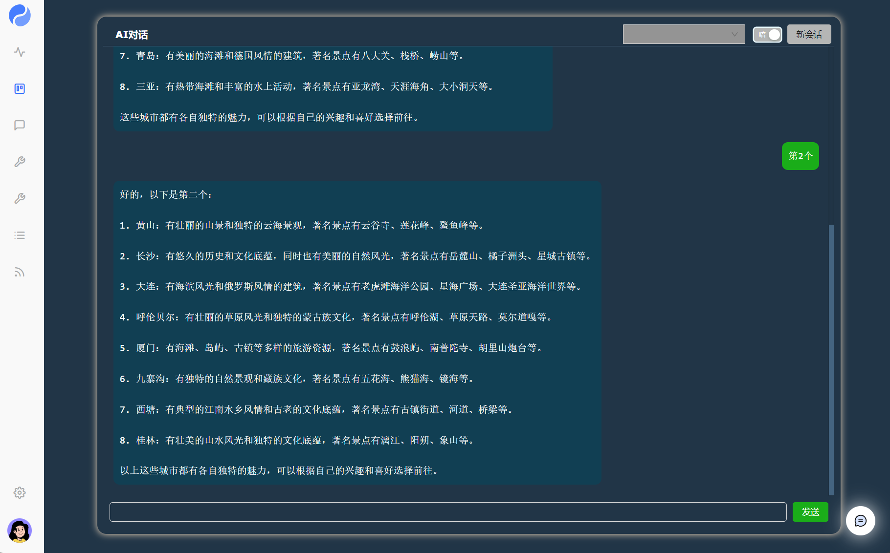
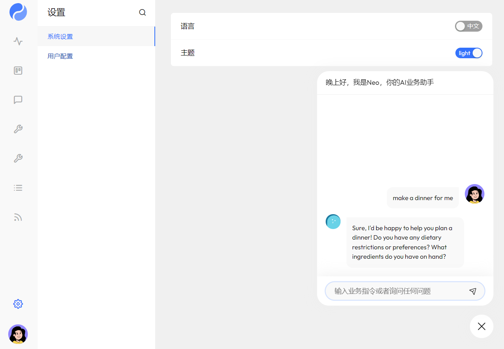

# 项目名称

使用 YAO engine 编写一个调用 openai chat gpt 接口的小应用

## 简介

本项目基于 yao engine 开发的一个 ai 聊天接口应用。它的主要功能是接收用户的提问，并调用 openai chat gpt 的提供的 api 接口。可以为用户提供一个简单的聊天应用。

## AI 对话



## XGEN NEO



## 功能

- 调用 chat gpt api 接口,提示会话上下文
- 支持 gpt3.5 接口
- 支持会话模板
- 后台保存会话历史
- 提供外部用户调用的 post/get 接口
- 插件 httpx 支持使用代理,可以配置里使用`use_plugin`启用插件访问 openai
- 提供后台系统配置，日志查看功能
- 最新版本的 xgen，可使用 neo 聊天助手
- 自定义 AI 聊天控件

## 安装

本项目依赖于 yao 引擎的开发版本 0.10.3，请先下载 yao 应用，下载地址：
https://github.com/YaoApp/yao/actions/workflows/release-linux.yml

这里提供本项目的安装步骤，例如：

```sh
https://github.com/wwsheng009/yao-chatgpt.git
cd yao-chatgpt
yao migrate
yao start
```

## 网络插件 httpx

如果你的网络可能不好，没办法直接访问 openai 接口，可以启用插件 httpx 的代替 yao 本身的`http.Post`方法。

[httpx 插件](plugins/httpx/readme.md)

## 加载提问模板

这一步测试使用脚本自动下载更新会失败。
所以需要手动下载一个模板文件。

```sh
wget https://raw.githubusercontent.com/PlexPt/awesome-chatgpt-prompts-zh/main/README.md -O data/中文调教指南.md.txt

#执行加载脚本
run scripts.loader.prompt_template.Run

```

## 使用说明

前端，打开就是一个对话的界面
http://127.0.0.1:5199

管理端
http://127.0.0.1:5199/admin/login/admin

默认用户名:
xiang@iqka.com
密码:
A123456p+

登录管理系统端后，需要在设置菜单界面输入您的 open ai 的调用 api key。或是执行以下脚本更新

```sh
yao run models.ai.setting.Update 1 '::{"api_token":"你的open ai key"}'
```

## 如何获取 openai api key.

可以在 OpenAI 官网上申请，也可以在 GitHub 上搜索，会有一些免费的 API Key 可以使用。

## 读取所有的 openai 的模型列表到本地

自动下载并更新本地 ai 模型列表，需要先更新 opnen ai 的 key

```sh
yao run scripts.ai.model.UpdateModel

```

## 管理员

删除重置系统用户,或是登录管理页面`http://127.0.0.1:5199/admin/x/Table/yao.user`进行配置

```sh
yao run scripts.utils.user.ResetAdmin 18012341234 xxx@qq.com Abcd1234+
```

## 测试 api 接口

```sh
yao run scripts.ai.chatgpt.Call '::{"prompt":"你好"}'
yao run models.chat.conversation.get '::{}'
yao run models.chat.message.get '::{}'
```

如果网络不通，请使用代理。[httpx 插件](plugins/httpx/readme.md)

## 开发

如果使用编辑器 vscode 编写 json 配置文件,已支持字段[提示与格式检查](https://wwsheng009.github.io/yao-docs/Studio/%E7%BC%96%E8%BE%91%E5%99%A8vscode%E6%99%BA%E8%83%BD%E6%8F%90%E7%A4%BA.html#%E7%BC%96%E8%BE%91%E5%99%A8vscode%E6%99%BA%E8%83%BD%E6%8F%90%E7%A4%BA)

## 许可证

本项目使用 Apache License 2.0 许可证，详情请参阅 [LICENSE.txt](LICENSE)
